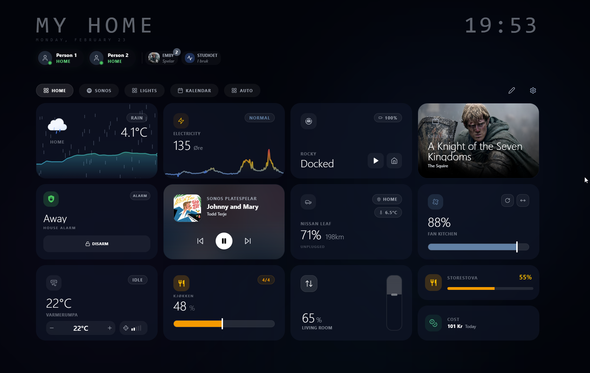

# Card Options Overview

Detailed overview of each card type, where it fits, and what can be configured.

## Screenshots

> Tip: If you want per-card screenshots, add images under `public/cards/` and reference them in each section below.

## Shared options (most cards)

- **Size**: `small` or `large` (when supported by that card type).
- **Custom name**: override Home Assistant friendly name.
- **Custom icon**: choose icon from icon picker.
- **Visibility controls**: hide/show based on state rules.
- **Popup trigger**: open card popup automatically on configured conditions.

## Card-by-card options

### Sensor

- Entity selection (`sensor.*`, `binary_sensor.*`, plus supported helper domains).
- Visual variant support (for numeric sensors): line/graph and gauge-like variants.
- Optional range/threshold settings (where relevant).
- Optional icon/value display tuning.

### Light

- Light entity selection.
- On-card quick controls (toggle/brightness shortcuts).
- Popup controls for brightness, color temperature, and RGB (depends on entity support).

### Climate

- Climate entity selection.
- On-card target temperature +/- controls.
- HVAC action/status feedback.
- Fan and swing controls shown only when entity supports those features.

### Fan

- Fan entity selection.
- On-card speed and power controls.
- Popup support for oscillation/direction/presets (capability-aware).

### Cover

- Cover entity selection.
- Position/tilt controls for supported entities.
- Device-class-aware labels (blind, shutter, garage, etc.).

### Vacuum

- Vacuum entity selection.
- State + quick actions (start/pause/return).
- Popup supports additional sensors/actions when exposed by integration.

### Camera

- Camera entity selection.
- Refresh mode and interval options.
- Stream engine selection (Auto/WebRTC/HA stream/Snapshot), with fallback behavior.

### Media

- Generic media-player focused flow.
- Best for Music Assistant playlist browsing.
- Uses selected `media_player` capabilities for browse/play support.

### SONOS

- Dedicated Sonos page/card mode.
- Group/ungroup workflows for selected Sonos players.
- Sonos Favorites browsing requires a Sonos `media_player`.

### Weather / Temp

- Weather entity + optional temperature source.
- Unit-aware rendering (follows configured unit mode/HA mode).
- Forecast/history visualization where data is available.

### Energy Cost

- Today + month entity mapping.
- Currency + display formatting options.

### Nordpool

- Nordpool sensor selection.
- Decimal precision and display formatting options.

### Room

- Build room card from Home Assistant area.
- Auto-suggested entities with optional manual mapping.
- Optional room visuals/toggles (e.g., icon watermark and status behaviors).

### Car

- Card-level mapping for EV-related sensors (battery/range/charging/temp/location).
- Optional custom image URL and per-sensor bindings.

### Person

- Person entity selection.
- Popup map + optional telemetry blocks (battery, speed, distance from home, etc.).

### Alarm

- Alarm entity selection.
- Arm/disarm actions, with PIN flow where required.
- Capability-aware action rendering from alarm integration.

### Calendar

- Calendar entity/list selection.
- Event rendering options from selected calendars.

### Todo

- To-do list entity selection.
- List item management in card/popup flow.

### Spacer

- Variant: `spacer` or `divider`.
- Layout/spacing behavior to structure dashboard sections.

## Notes for maintainers

- Keep this file in sync when adding new card settings in edit modals.
- If a card gains/removes options, update its section here in the same PR.
- Prefer capability-aware wording (`if supported by entity`) for integration-specific features.
