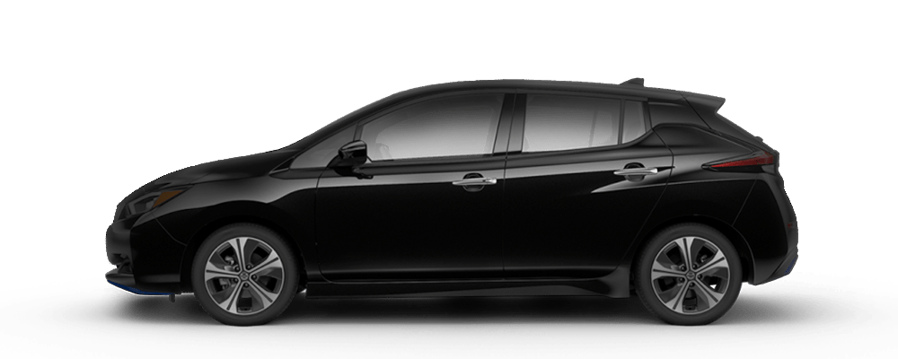

# 🏠 Midttunet Dashboard

A modern, responsive React dashboard application for home automation and energy monitoring, built with Vite and styled for optimal performance.

## 📋 Overview

Midttunet is a feature-rich home automation dashboard that integrates with smart home systems to provide real-time monitoring and control of:

- 🌡️ Climate and heating systems
- ⚡ Energy consumption and pricing
- 🚗 Vehicle status and battery levels
- 💡 Lighting control
- 🚪 Door sensors and presence detection
- 📊 Data visualization and analytics

## 🚀 Quick Start
# 🏠 Midttunet Dashboard

A modern, responsive React dashboard application for home automation and energy monitoring, built with Vite and styled for optimal performance.

## 📋 Overview

Midttunet is a feature-rich home automation dashboard that integrates with smart home systems to provide real-time monitoring and control of:

- 🌡️ Climate and heating systems
- ⚡ Energy consumption and pricing
- 🚗 Vehicle status and battery levels
- 💡 Lighting control
- 🚪 Door sensors and presence detection
- 📊 Data visualization and analytics

## 📝 Summary

Midttunet consolidates household telemetry and control into a single, easy-to-use dashboard. It aggregates data from smart meters, thermostats, EV chargers, and sensors to visualize consumption trends, optimize energy usage based on price signals, and provide quick access to device controls. The UI focuses on clarity and real-time updates so users can make informed decisions about energy and comfort.

## 🖼️ Screenshots

Below are example screenshots from the app. Add more images to the `public/` folder and reference them here to include them in the README.



_Add additional screenshots by copying files into `public/` and inserting Markdown image links:_

```markdown

```

## 🚀 Quick Start

### Prerequisites
- Node.js 18+ (or Docker Desktop for containerized setup)
- npm or yarn package manager

### Installation

1. Clone the repository:
```bash
git clone https://github.com/oyvhov/midttunet.git
cd midttunet
```

2. Install dependencies:
```bash
npm install
```

3. Start the development server:
```bash
npm run dev
```

The application will be available at `http://localhost:5173`

## 🛠️ Development

### Available Scripts

- `npm run dev` - Start Vite development server with hot module replacement
- `npm run build` - Build for production with optimizations
- `npm run preview` - Preview the production build locally
- `npm run lint` - Run ESLint to check code quality

## 📦 Technologies

- **React 18** - UI library for building components
- **Vite 7** - Fast build tool and dev server
- **Lucide React** - Modern icon library
- **Tailwind CSS** - Utility-first CSS framework (styling)

## 🐳 Docker Support

The project includes Docker configuration for easy deployment:

```bash
docker-compose up
```

This will build and run the application in a Docker container.

## 📁 Project Structure

```
midttunet/
├── src/
│   ├── App.jsx          # Main application component
│   ├── main.jsx         # React entry point
│   └── ...              # Additional components
├── index.html           # HTML template
├── package.json         # Dependencies and scripts
├── vite.config.js       # Vite configuration
├── Dockerfile           # Docker image definition
├── docker-compose.yml   # Docker compose setup
└── README.md            # This file
```

## 🤝 Contributing

Contributions are welcome! Feel free to submit issues or pull requests.

## 📄 License

This project is licensed under the MIT License - see the [LICENSE](LICENSE) file for details.

## 👤 Author

Created by [oyvhov](https://github.com/oyvhov)