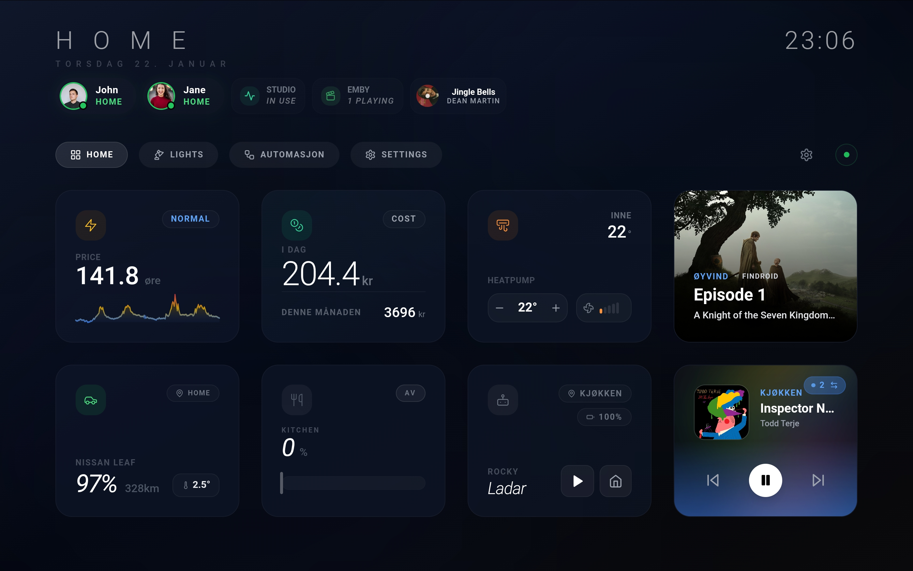

# Tunet Dashboard

A modern React dashboard for Home Assistant with real-time entity control, energy monitoring, and multi-device profile sync.



## Features

### 🎴 Cards
- **Universal Sensor Card**: One card to rule them all. Handles numeric sensors (with history graphs), binary sensors (doors, windows, motion), switches, input booleans, scripts, and scenes.
- **Specialized Control Cards**: 
  - **Light**: Brightness, color (RGB/temp), and toggle limits.
  - **Climate**: Thermostat modes, target temperature, and HVAC action feedback.
  - **Media**: Generic media players + dedicated **Android TV** remote with app launching.
  - **Cover**: Position sliders for blinds and toggle controls for garage doors.
  - **Vacuum**: State monitoring, start/pause/dock commands.
  - **Fan**: Speed percentage, oscillation, and direction controls.
- **Energy & Environment**:
  - **Nordpool**: Hourly electricity prices with beautiful trend graphs.
  - **Energy Cost**: Track daily and monthly energy expenditure.
  - **Weather**: Dynamic weather animations, current temperature, and forecasts.
  - **Car**: EV monitoring (battery, range, charging status).
- **Productivity & Organization**:
  - **Calendar**: Agenda view for upcoming events.
  - **Todo Lists**: Manage Home Assistant to-do items.
  - **Room Card**: Compact summary of a room's state (lights, temp, occupancy).
  - **Person**: Presence detection and location tracking.

### 🚀 Advanced Capabilities
- **Server-side Profiles**: Save layout configurations per user, accessible on any device.
- **Live Updates**: Instant state reflection via Home Assistant WebSocket.
- **Drag-and-Drop Grid**: Fully customizable masonry layout.
- **Settings Lock**: PIN protection prevents accidental edits.
- **Theming**: Dark/Light modes with high-end glassmorphism and animated backgrounds.
- **Multi-language**: Native support for English, German, Norwegian (NB/NN), and Swedish.

## Quick Start

### Home Assistant Add-on

1. Go to **Settings** -> **Add-ons** -> **Add-on Store** -> **Repositories** (three dots).
2. Add `https://github.com/oyvhov/tunet`.
3. Install **Tunet Dashboard**.
4. Configure and Start.

### Docker Compose (Recommended)

```bash
git clone https://github.com/oyvhov/tunet.git
cd tunet
docker compose up -d
```

Open `http://localhost:3002` and connect your Home Assistant instance.

### Local Development

```bash
git clone https://github.com/oyvhov/tunet.git
cd tunet
npm install
npm run dev:all
```

- Frontend: `http://localhost:5173`
- Backend API: `http://localhost:3002/api`

## Updating

See [SETUP.md](SETUP.md) for detailed setup, configuration, and troubleshooting.

## Technologies

- React 18 + Vite 7
- Tailwind CSS 4
- Express + SQLite (profile storage)
- Home Assistant WebSocket API
- Lucide Icons + MDI

## 🗺️ Roadmap

See our [ROADMAP.md](ROADMAP.md) for planned features and future development.

## License

GNU General Public License v3.0 — See [LICENSE](LICENSE)

## Author

[oyvhov](https://github.com/oyvhov)
