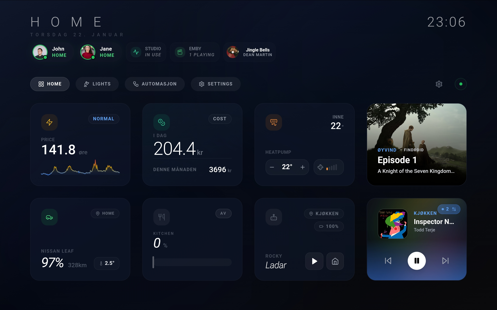
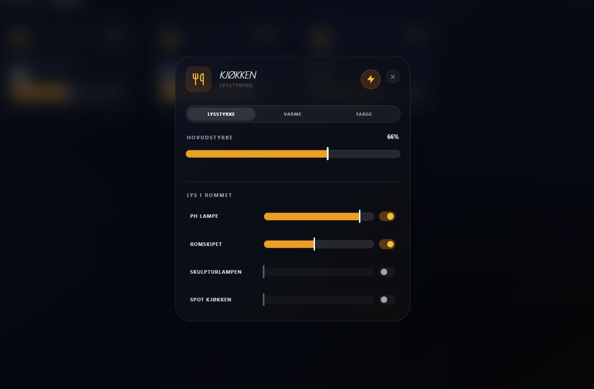

#  NoName Dashboard

A modern React dashboard for home automation and energy monitoring with Home Assistant integration.

## Features

- Climate & heating control
- Energy consumption tracking with real-time pricing
- Vehicle status monitoring (Nissan Leaf)
- Lighting control with color/warmth adjustment
- Door sensors & presence detection
- Media player control (Sonos, Jellyfin, Emby)
- Customizable dashboard layout & header
- Dark/Light theme
- Multi-language (English, Nynorsk)

## Main Dashboard

## Quick Start

### Prerequisites

- Node.js 18+
- Home Assistant instance with API token

### Installation

\\\ash
git clone https://github.com/oyvhov/NoName.git
cd NoName
npm install
npm run dev
\\\

Access at \http://localhost:5173\

## Configuration

1. Open dashboard settings ()
2. Add Home Assistant URL and token
3. Customize layout in edit mode

## Build & Deploy

\\\ash
npm run build
\\\

Docker:
\\\ash
docker-compose up
\\\

## Light Control

## Technologies

- React 18
- Vite 7
- Tailwind CSS
- Lucide Icons
- Home Assistant API

## Project Structure

\\\
src/
 App.jsx              # Main component
 components/          # UI components
 hooks/              # Custom hooks
 services/           # HA integration
 i18n/               # Translations
 themes.js           # Theme config
\\\

## License

MIT - See [LICENSE](LICENSE) for details

## Author

[oyvhov](https://github.com/oyvhov)
